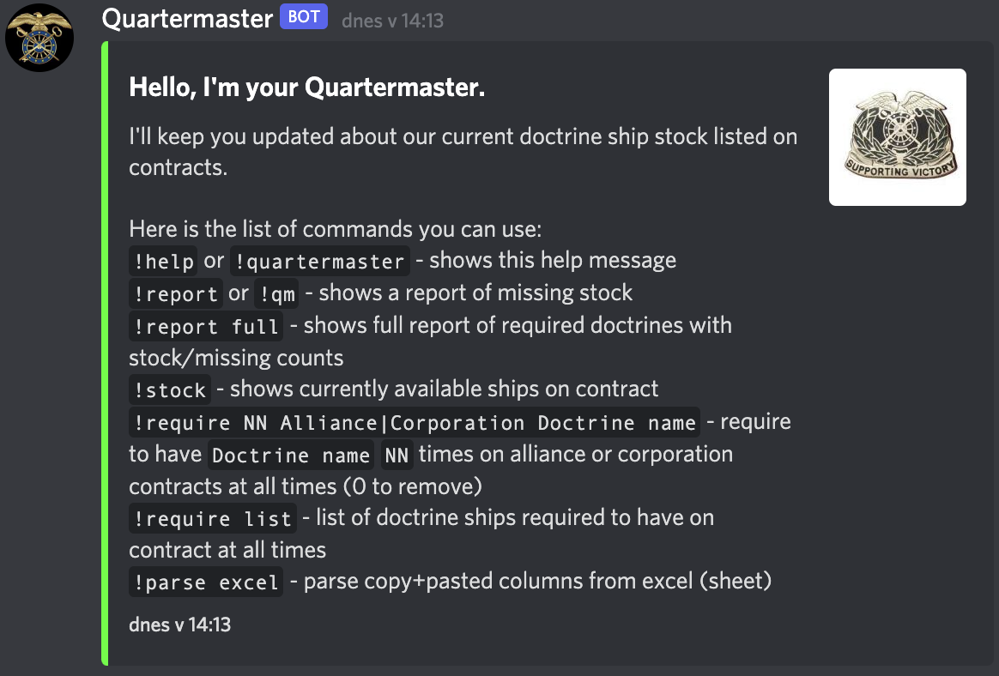
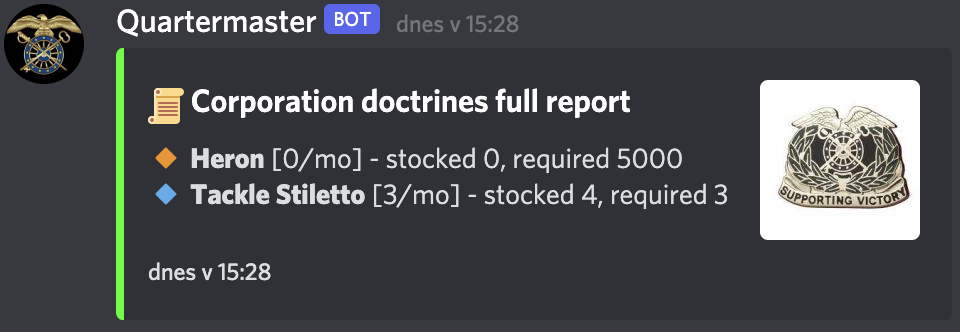

# EVE-Quartermaster

  

## Features

### Add required doctrines
The bot uses contract title to be able to tell what is in the contract. Make sure your corporation fittings and contract names are identical. It will help alot with managing things.

To **add 5000 Herons to be on Corporation Contract** at all times:
```
!require 5000 Corp Heron
```

### Report of missing stock
To trigger quick report of missing doctrines, use `!report` or `!qm`.  


### Periodic reminder of missing stock
The bot will call EVE ESI every `--check_interval` and will send quick report to a channel specified by `--discord_channel_id`.

### Full report
Full report contains all doctrine ships that were added using `!require`, regardless of the stock.

You can use this to easily see what is required, how many do you have in stock, and how many contract of each were accepted per month.  


### Bulk add
To add many doctrines at once, you can copy+paste from excel or google sheet.
```
!parse excel
Heron	5000	Corporation
Tackle Stiletto	3	Corporation
```

Be aware this will overwrite everything you added by hand using `!require`!

### Other
You can see what you have in stock `!stock` - or at least how the bot parses those contracts.

And to list what is required: `!require list`.
   
## Set-up
1. Download binary for your architecture in `releases` section.
### Part 1 - Get the Acess Tokens
2. Go to [EVE developer portal](https://developers.eveonline.com/applications) and create a EVE app for the bot
   1. Grab the `Client ID` and `Secret Key`
   2. Set `Callback URL` to `    http://localhost:3000/callback `
   3. Add these scopes to the APP: `publicData, esi-contracts.read_corporation_contracts.v1`
3. Go to [Discord Developer Portal](https://discordapp.com/developers/applications) and create new APP.
   1. Add `Bot` to this APP.
   2. Make the `bot` `public` so it can be added to your corp discord.
   3. Grab the `Token`
4. Create RANDOM string for SESSION storage (you can use openssl, or just make something by hand)

### Part 2 - Login to EVE with the bot
4. Run this command and fill in the missing variables with what you got in `Part 1`:
    ```
    quartermaster login -s "RANDOM_STRING" --eve_client_id="FILLME" --eve_sso_secret="FILLME"
    ```
    This will open web browser, and will authorize you with EVE account.
    When it is successfull, you can close the browser tab, and it will save the authentization information
    in `auth.bin` file.
    
    Docker version:
    ```bash
   $ docker volume create eve-quartermaster

   $ docker run -v eve-quartermaster:/auth/ -p 3000:3000 lunemec/eve-quartermaster:latest login --auth_file=/auth/auth.bin -s "$RANDOM_STRING" --eve_client_id="$CLIENT_ID" --eve_sso_secret="$SSO_SECRET"
   ```

### Part 3 - Run the bot and invite it to discord
5. Copy the discord ChannelID where you want your bot (you have to enable DEV mode)
6. Test-run the bot on some test server so you don't spam everyone:
    ```
    quartermaster run -s "RANDOM_STRING" --discord_auth_token="FILLME" --discord_channel_id="FILLME" --eve_client_id="FILLME" --eve_sso_secret="FILLME" --corporation_id="FILLME" --alliance_id="FILLME"
    ```
   Docker version:
   ```bash
   $ docker run -v eve-quartermaster:/auth/ lunemec/eve-quartermaster:latest run -s "$RANDOM_STRING" -a "/auth/auth.bin" --eve_client_id="$CLIENT_ID" --eve_sso_secret="$SSO_SECRET" --discord_auth_token="$DISCORD_TOKEN" --discord_channel_id="$DISCORD_CHANNEL_ID"
   ```


    You can modify these parameters to make the bot trigger a message:
    ```
    Usage:
    eve-quartermaster run [flags]

    Flags:
        --alliance_id int32           Alliance ID for which to list contracts
    -a, --auth_file string            path to file where to save authentication data (default "auth.bin")
        --check_interval duration     how often to check EVE ESI API (default 30min) (default 30m0s)
        --corporation_id int32        Corporation ID for which to list contracts
        --discord_auth_token string   Auth token for discord
        --discord_channel_id string   ID of discord channel
        --eve_client_id string        EVE APP client id
        --eve_sso_secret string       EVE APP SSO secret
    -h, --help                        help for run
        --notify_interval duration    how often to spam Discord (default 24H) (default 24h0m0s)
        --repository_file string      path to repository json to save require_stock data (default repository.json) (default "repository.json")
    -s, --session_key string          session key, use random string
    ```

7. Go to [Discord Developer Portal](https://discordapp.com/developers/applications) and create new APP.
   1. Get the invite link for your bot: `OAuth2` section
      1. Click on `Scopes`: `bot`
      2. `Text Permissions`: `Send Messages`
      3. Open the `URL` that was generated in `Scopes` block, and invite your bot to some server.
8. If you managed to trigger a message, you're good to continue to the next part.
   
### Part 4 - Run the bot on some server
I prepared `systemd` (under /debian/) unit, but you have to copy it and the binary by hand. If someone wants to create
a `.deb` file or some other package, feel free to do so.

If you are successfull, you should see the Bot's icon in the discord users list in the channel.


## No need to say thanks, that is what ISK is for.
If you like this bot and use it, consider donating some ISK to `Lukas Nemec`. Thanks.
